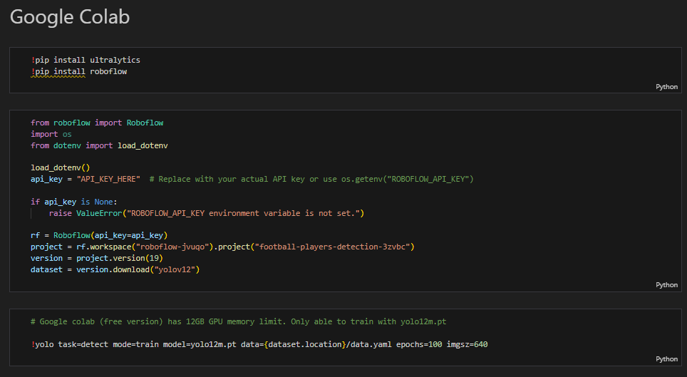

# Football Video Analysis

This application is an end-to-end pipeline that analyzes football videos. It processes a football match video, track players and the ball, identify teams, assign ball possession, and generate an annotated output video.

### Use Case

The use case application can be used to:
- Analyze player performance by tracking movements, ball touches, and possession statistics.
- Support coaching and training with actionable insights from annotated match footage.
- Assist scouting and recruitment by generating objective player and team analytics.
- Enhance broadcast content with real-time annotations and match statistics for viewers.
- Engage fans with interactive visualizations and highlight reels.

**Current Limitation:** Ball detection is not yet robust due to the training data available (Camera angle in the training data is slightly different). There are a few false positive where the white player boots are incorrectly identified as a ball. This affects the interpolation of ball movement between frames which should have helped the ball detection (green triangle) visualisation. I have commented this out in the meantime.

**Use Case example**


**Video source:**

Manchester United v ASEAN All-Stars | Match Recap
https://www.youtube.com/watch?v=NYS5HSUVdz8

## Contents
- Folder Structure
- Core Functionality
- How to run this application?
- How to use the application?

### Folder Structure
```
./
├── .env
├── .gitignore
├── LICENSE
├── README.md
├── requirements.txt
├── config/
│   └── app.yaml
├── artifacts/
│   ├── fine_tuned_models/
│   │   └── {models}.pt
│   ├── raw_models/
│   │   └── {models}.pt
│   └── stubs/
│       └── {output_video}_stub.pkl
├── demo_assets/
│   └── man_united_asean_allstars_analysis.gif
├── hydra_logs/
│   └── {date}
│       └── {time}
├── input_videos/
│   └── {video}.mp4
├── output_videos/
│   └── {video}_analysis.avi
├── development_and_analysis/
│   ├── model_test/
│   │   ├── model_inference_roboflow.py
│   │   └── model_inference.py
│   └── team_assignment/
│       ├── cropped_player/
│       │   └── {image}.jpg
│       └── clustering_for_team_color.ipynb
├── src/
│   ├── app.py
│   ├── ball_possession/
│   │   ├── init.py
│   │   └── ball_possession.py
│   ├── player_with_ball/
│   │   ├── init.py
│   │   └── player_with_ball.py
│   ├── team_identifier/
│   │   ├── init.py
│   │   └── team_identifier.py
│   ├── trackers/
│   │   ├── init.py
│   │   └── tracker.py
│   └── utils/
│       ├── init.py
│       ├── bbox_utils.py
│       └── video_utils.py
└── training/
    ├── football-players-detection-19/
    │   ├── test/
    │   ├── train/
    │   ├── valid/
    │   ├── data.yaml
    │   ├── README.dataset.txt
    │   └── README.roboflow.txt
    ├── runs
    │   └── detect/
    │       └── train/
    │           └── {model_weights_and_results files}
    └── football_training_yolo_v12.ipynb
```
### Core Functionality

1. Configuration and Logging

    The script uses Hydra for configuration management and sets up logging for tracking progress and errors.

2. Video Frame Extraction

    It reads the input video file path from the configuration, checks for existence and format, and loads the video frames into memory.

3. Detection and Tracking

    `player`, `refree`, `ball`: Uses a fine-tuned Yolo12m model to detect players, refree and ball in frames.

    Training was done on Google Colab. Uses a publicly available dataset via  `model_id: "football-players-detection-3zvbc/19"`

    Ideally, would have like to use yolo12x. However, scaled down to yolo12m due to compute limitation on the free version of google colab.

4. Team Identification

    The script identifies team colors via KMeans clustering. It then assigns a team label and color to each player in every frame based on their jersey color.

5. Ball Assignment and Possession Tracking

    For each frame, the script assigns the ball to the closest player. It records which team has possession for each frame. This allows for ball possession calculation.

6. Annotation

    The script draws annotations (such as custom ellipse boxes at the base of referees and players, green triangle on the ball, custom color based on team identification, and possession stats) on each frame.

7. Video Output

    Saves the annotated frames as a new output video file.

8. Error Handling

    Throughout, the script checks for missing data and logs errors, ensuring robust execution.

### How to run this application?

To run this application, follow these steps:

1. Clone the Repository:

    Open your terminal or command prompt.
    Use git clone to download the project files.

    ```
    git clone https://github.com/d3smondwong/football_video_analysis.git
    ```
2. Navigate into the cloned project directory:

    ```
    cd [your_project_directory]
    ```
3. Set up Environment Variables:

    a. Create a `.env` file in the project directory

    b. Open the newly created .env file with a text editor and add your     ROBOFLOW API Key:

    ```
    ROBOFLOW_API_KEY="YOUR_API_KEY_HERE"
    ```
    &nbsp;&nbsp;&nbsp;&nbsp;Replace "YOUR_API_KEY_HERE" with your actual Roboflow API key.

4. Install Dependencies:

    a. Ensure you are still in the project's root directory (where requirements.txt is located).

    b. Run the following command to install all necessary Python libraries:

    ```
    pip install -r requirements.txt
    ```
5. Model Training

    a. Download the preferred YOLO model from [Ultralytics YOLOv12 Models](https://docs.ultralytics.com/models/yolo12/#performance-metrics)

    b. Open up `football_training_yolo_v12.ipynb` in the folder `.\training\

    c. Copy the code to your google colab work space 

    d. Run the code

    e. Select the `{best_model}.pt` and place it in the following folder `.\artifacts\fine_tuned_models\`

    f. update the config file `.\config\app.yaml`

    

5. Put the video you will like the application to analyse in the folder `input_videos`. Supported formats are `.mp4`, `.avi` and `.mov`

6. Run the application:

    From your project's root directory in the terminal, execute:

    ```
    python -m src.app

    ```
    This will run the application and output the annotated video in the folder `output_videos`. The output file name will be the combination of input file name and output to give `{input file name}_analysis.avi`